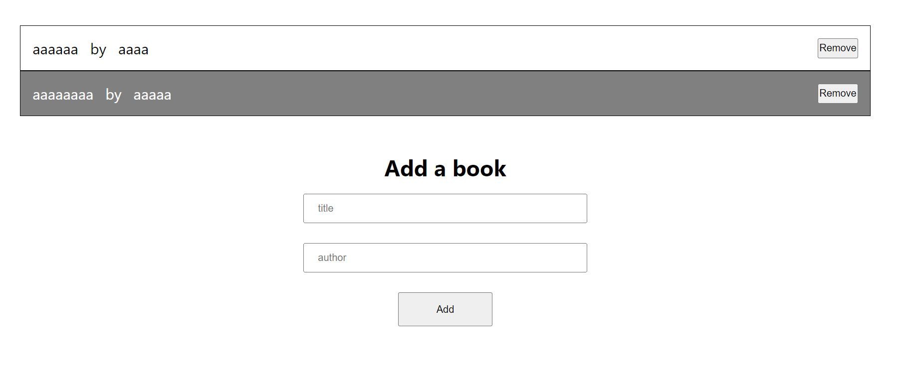
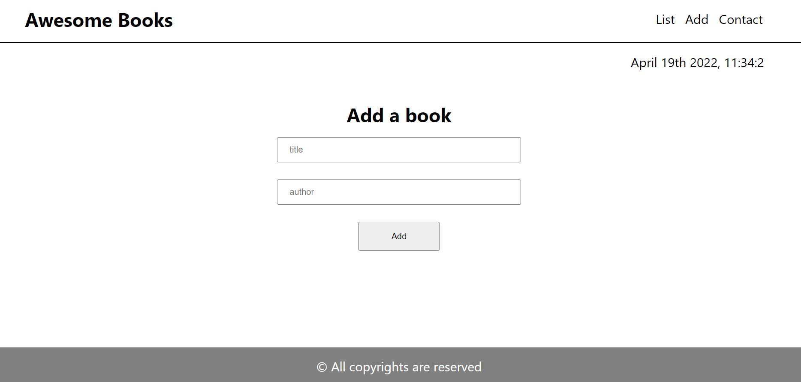

# Awesome Books
> A Microverse pair programming project on book library.

</img>

</img>

</img>

## live DEMO:
[Live Demo](https://tahenybelguith.github.io/Awesome--Book/)
## Built With

- HTML5
- Js

### Prerequisites
- Create Github repository
- Have VSCode or choice text editor installed
- Have Git installed
- HTML/CSS Linters
- Good github workflow
- `open index.html file` .
  

### Setup
- `Git clone git@github.com:S-imba/Awesome-Book.git`
- `cd awesome-book`
- open file in preferred editor
- Edit to your satisfaction
- HTML, CSS Linter configuration - https://github.com/microverseinc/linters-config/tree/master/html-css

## Authors
👩 **Taheny Belguith**

- GitHub: [@TahenyBELGUITH](https://github.com/TahenyBELGUITH)
- Twitter: [@BelguithTaheny](https://twitter.com/BelguithTaheny)
- LinkedIn: [belguith taheny](https://www.linkedin.com/in/belguith-taheny-47b93a162/)

🧑  **Simba Eugene**

- GitHub: [@S-imba](https://github.com/S-imba)
- Twitter: [@simb_erella](https://twitter.com/simb_erella)
- LinkesIn: [Simba Wangulu](https://www.linkedin.com/in/simba-wangulu/)

## 🤝 Contributing

Contributions, issues, and feature requests are welcome!

Feel free to check the [issues page](../../issues/).

## Show your support

Give a ⭐️ if you like this project!

## Acknowledgments

- [Microverse](https://github.com/microverseinc)

## 📝 License

This project is [MIT](./MIT.md) licensed.
